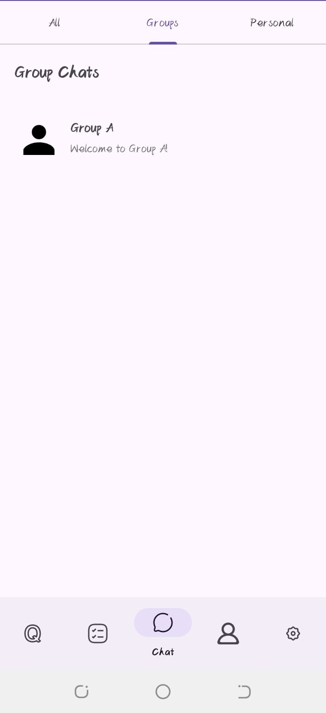

# 📚 Social Learn App

Social Learn App is an Android application built with **Java/Kotlin, XML layouts, and Firebase** that allows users to learn socially by combining features like quizzes, tasks, and chat.

---

## 🚀 Features
- 🔐 User Authentication (Firebase Authentication)
- 📝 Quizzes with timers and scoreboards
- 📊 Personal Task Manager with filters
- 💬 Real-time Chat with other learners
- 🎯 AdMob Ads Integration (Banner, Interstitial, Open Ads)
- ☁️ Firebase Realtime Database for data storage

---

## 🛠️ Tech Stack
- **Frontend:** Android (Java/Kotlin, XML)
- **Backend:** Firebase Authentication, Firebase Realtime Database
- **Tools:** Android Studio, Git, GitHub
- **Ads:** Google AdMob

---

## 📱 Screenshots

<table>
  <tr>
    <th>Splash</th>
    <th>Login</th>
    <th>Register</th>
    <th>ResetEmail</th>
  </tr>
  <tr>
    <td></td>
    <td></td>
    <td></td>
    <td></td>
  </tr>
</table>

<table>
  <tr>
    <th>Welcome</th>
    <th>Banne_rAd</th>
    <th>Interstial</th>
    <th>Email</th>
  </tr>
  <tr>
    <td></td>
    <td></td>
    <td></td>
    <td></td>
  </tr>
</table>
<table>
  <tr>
    <th>Home_Screen</th>
    <th>Quiz</th>
    <th>Task_Screen</th>
    <th>Task_List</th>
  </tr>
  <tr>
    <td></td>
    <td></td>
    <td></td>
    <td></td>
   
  </tr>
</table>
<table>
  <tr>
    <th>Edit_Task</th>
    <th>All_Chats</th>
    <th>Group_Chats</th>
    <th>Personal_Chats</th>
  </tr>
  <tr>
    <td></td>
    <td></td>
    <td></td>
    <td></td>
  </tr>
</table>

<table>
  <tr>
    <th>Settings</th>
    <th>Privacy</th>
    <th>Log_out</th>
    <th>Dark_Theme</th>
  </tr>
  <tr>
    <td></td>
    <td></td>
    <td></td>
    <td></td>
  </tr>
</table>

---

## 🔧 Installation
1. Clone the repository:
   ```bash
   git clone https://github.com/ifra489/social-learn-app.git
   
Open the project in Android Studio.

Sync Gradle and install dependencies.

Add your own google-services.json file for Firebase.

Run the app on an emulator or real device.
